# TD : CI/CD avec GitHub Actions et Clever Cloud

## 🎯 Objectif du TD

Déployer automatiquement une application React sur Clever Cloud via un pipeline CI/CD avec GitHub Actions.

## 📋 Prérequis

- Compte GitHub personnel
- Compte Clever Cloud (gratuit) avec votre adresse `@3il.fr` : [Clever Cloud Console](https://console.clever-cloud.com/) 
- Git installé sur votre machine
- NodeJS installé en local (https://nodejs.org/fr/download)

## 🚀 Étapes du TD

### 1. Création du projet à partir de MyFITJob

1. Allez sur le repository GitHub du projet [https://github.com/CodinCloud/MyFITJob](https://github.com/CodinCloud/MyFITJob)

2. Cliquez sur "Use this template" en haut à droite
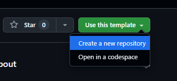

3. Nommer votre projet pour ne pas le confondre avec le projet MyFITJob original:  

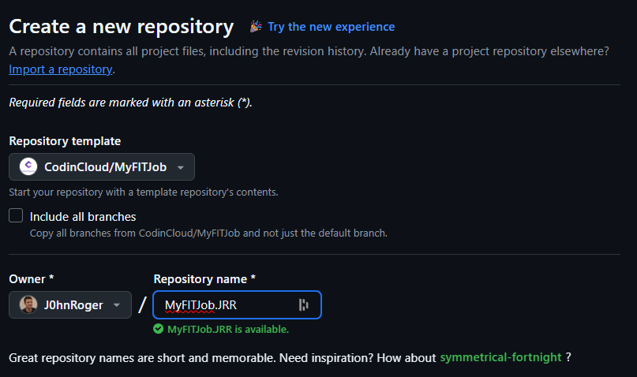

4. Clonez cette nouvelle version (de votre Github personel) en local :

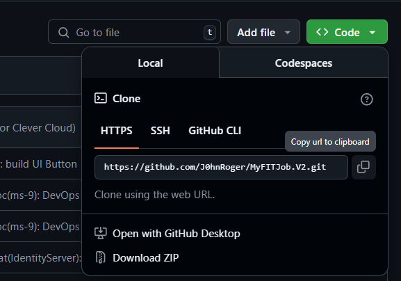

   ```bash
   git clone https://github.com/VOTRE_USERNAME/MyFITJob.git
   cd MyFITJob
   ```

5. Valider que le projet fonctionne: 

- Se rendre dans /src/MyFITJob.Frontend

```
npm i
npm run dev
```

*exemple:* 

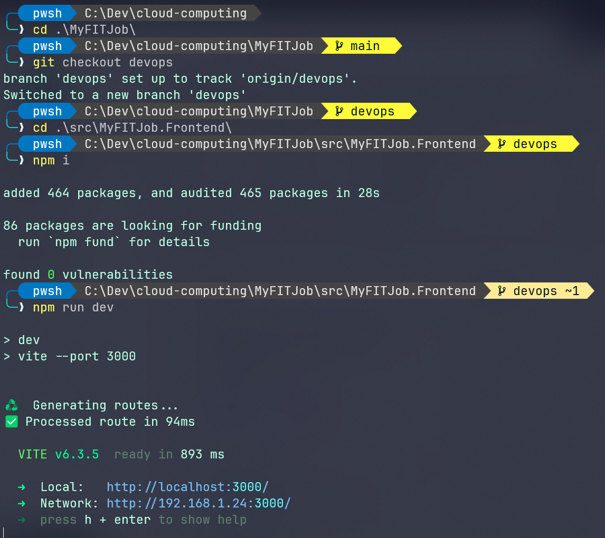
*Résultat:* 

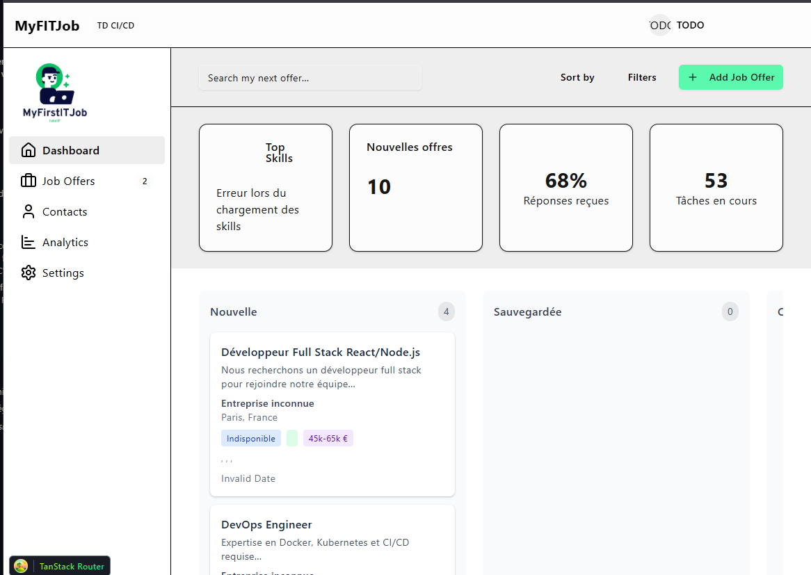

### 2. Configuration Clever Cloud

1. **Créer un compte Clever Cloud**
   - Allez sur [console.clever-cloud.com](https://console.clever-cloud.com/)
   - Créez un compte gratuit avec votre email de l'ENI

2. **Créer une application**
   - Dans la console Clever Cloud, cliquez sur "Create an application"
   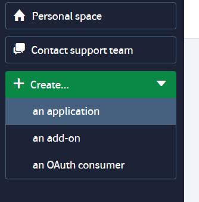
   - Choississez "Create an application from a Github repository" 
   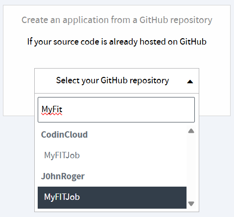
   - Selectionner le repo "fork" à l'étape précedente
   - Selectionner l'application Docker: 
   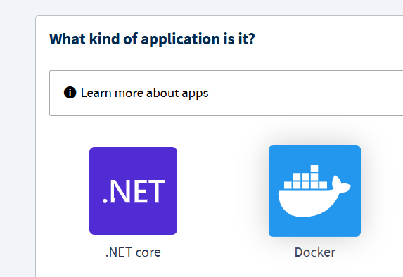
   - Pour la partie Scalabilité : Cliquer sur "Next" 
   - Nommez votre application : `myfitjob-frontend`
   - Cliquer sur "Create"
   - Cliquer sur "I don't need any Add-ons
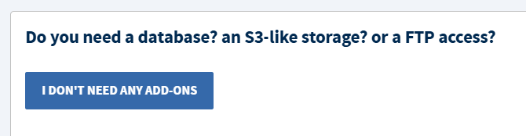
   - Variables d'env: cliquer sur Next  
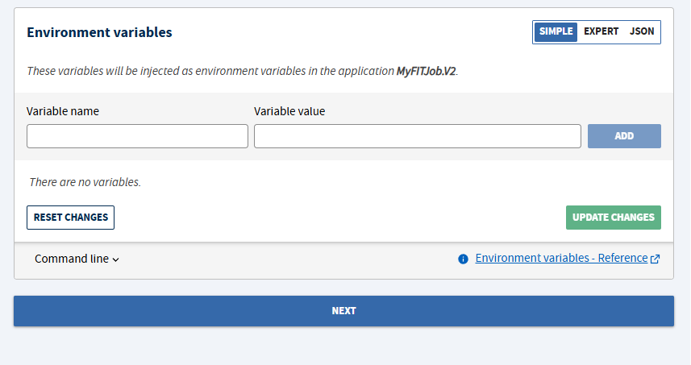

Vous devriez avoir l'écran de chargement de l'application: 
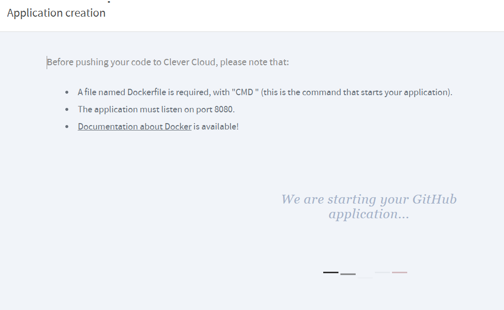

> A ce stade, après quelques minutes, votre application devrait être déployée : 

.png)

3. Accéder à votre application en ligne - l'icone "Lien" dnas le Header de la page: 
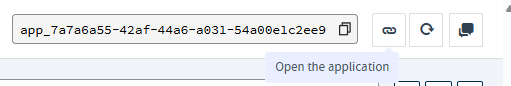

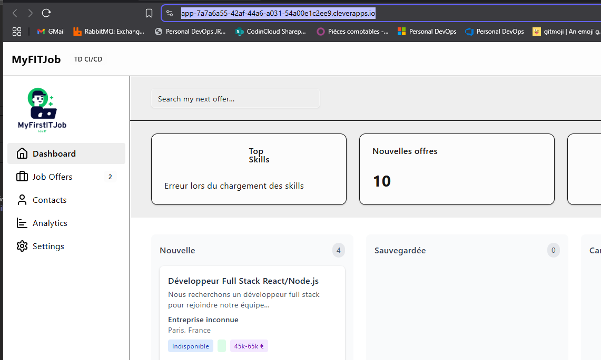

> Checkpoint: Vous avez déployer votre code à partir de Clever Cloud, manuellement. Maintenant, il va falloir automatiser ce déploiement à chaque fois qu'on met à jour le code source dans votre répository.

### 3. Configurer la CI/CD dans Github 

> J'ai créé le fichier `.github/workflows/ci_cd_clever.yml` qui permet de déployer automatiquement l'application sur Clever Cloud à partir du package fourni par l'éditeur `clever-tools`. Si vous regardez ce fichier, vous verrez des references à des SECRETS (cf cours sur la sécurité). 

Les 3 secrets à renseignés dans Github Actions:
- `CLEVER_TOKEN` : Votre token Clever Cloud
- `CLEVER_SECRET` : Votre secret Clever Cloud
- `GH_TOKEN` : le Token PAT de votre compte Github, pour permettre à Clever CLoud de notifier votre Merge Request avec l'URL de l'application déployée.

Pour générer les valeurs de TOKEN et SECRETS, il faut les générer en local à partir de l'utilisataire de clever-cloud:

1. installer l'outil de clever-cloud de manière globale sur votre poste : 
`npm i -g clever-tools`  
2. Lancer la commande `clever login` 
3. Saisissez vos identifiants/mdp
Vous devriez être redirigé sur une page affichant votre TOKEN et votre SECRET

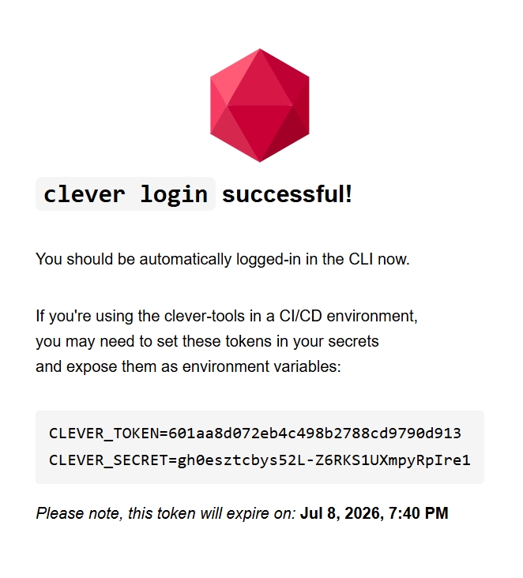

4. Noter les valeurs de CLEVER_TOKEN et CLEVER_SECRET, nous en aurons besoin pour la configuration du pipeline sur Github 

5. Pour récupérer la valeur du secrets `GH_TOKEN`, se rendre sur votre interface Github: `https://github.com/settings/tokens`
6. Cliquer sur "Generate new Token" , et choisir "Generate new Token (fine-grained repo-scoped): 
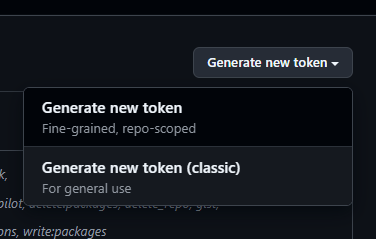

7. Donner un nom à ce token, par exemple `Clever Cloud PR` 
8. COCHER les bons droits à accorder via ce token : 
- "Issues" repository permissions (write)
- "Pull requests" repository permissions (write)

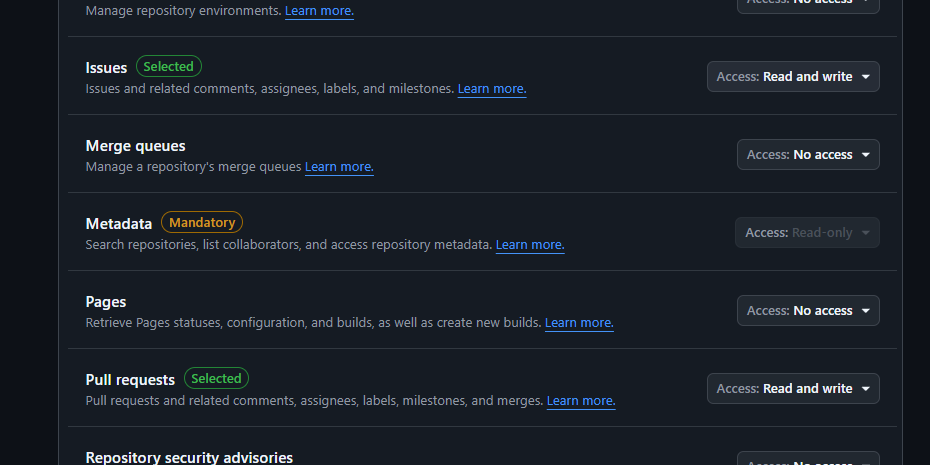

9. Valider et surtout copier le PAT : 
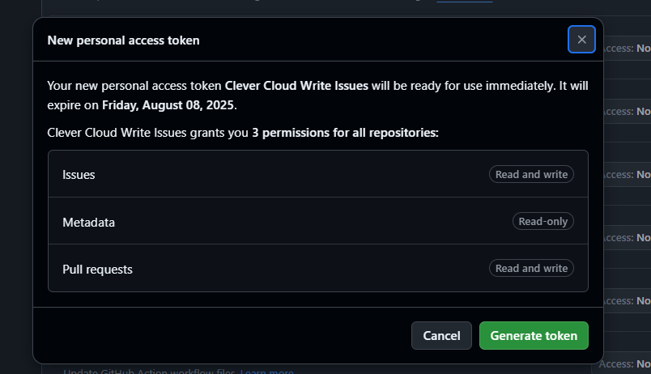

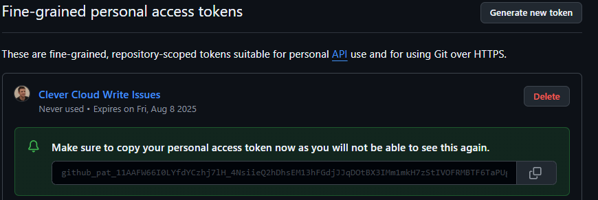

--- 

Nous allons renseigner ces 3 `secrets` dans votre repository Github personel :   

5. Se rendre dans les "Settings" de Github: 
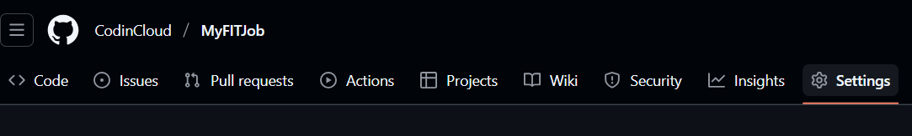

6. Dans le menu "Security", cliquer sur "Actions" 
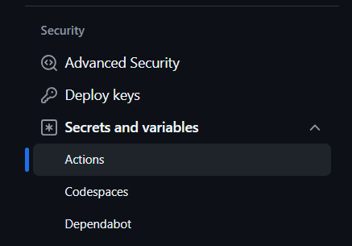

7. Cliquer sur "New Repository Secret"
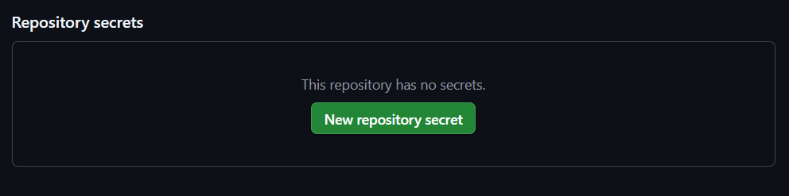

- Ajouter les secrets suivants (attention à ne pas laisser d'espaces vides): 

- `CLEVER_TOKEN` : Votre token Clever Cloud
- `CLEVER_SECRET` : Votre secret Clever Cloud
- `GH_TOKEN`: Le PAT généré sur Github (`github_pat_<id>`)

Une fois les 3 `secrets` renseignés comme suit : 

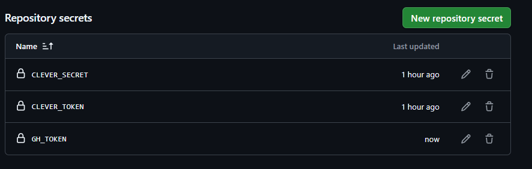

Nous allons maintenant tester un déploiement manuellement, mais depuis Github:  

1. Se rendre dans l'onglet "Actions": 

2. Vous devriez arriver sur l'écran de gestion des workflows: notre workflow "CI/CD - Deploy to Clerver Cloud" est normalement apparent dans la barre latérale : 
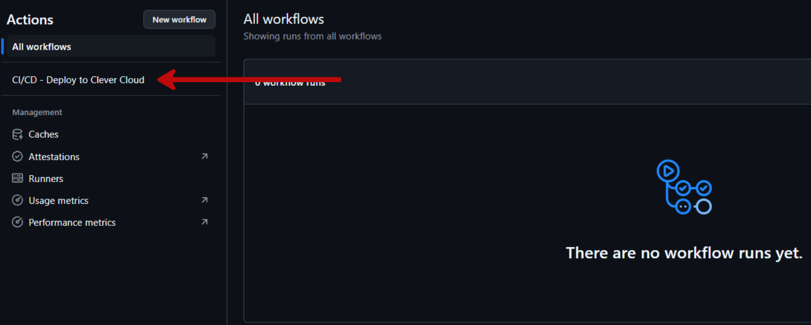

> Vous remarquerez que ce fichier s'appelle pareil que dans le fichier `./github/workflows/ci_cd_clever.yml` : Github interprete les fichiers .yml dans ce répertoire comme des flux de déploiement CI/CD 

3. Cliquer sur ce workflow, puis sur le bouton vert "Run workflow", à partir de la branche `main`
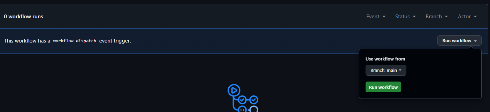

4. Le déploiement doit alors se déclencher, vous pouvez cliquer sur ce dernier pour observer chaque étape de la build: 


Pour autant, dans le détail de la build, vous pouvez voir qu'une étape n'a pas été executées sur cette demande manuelle : 

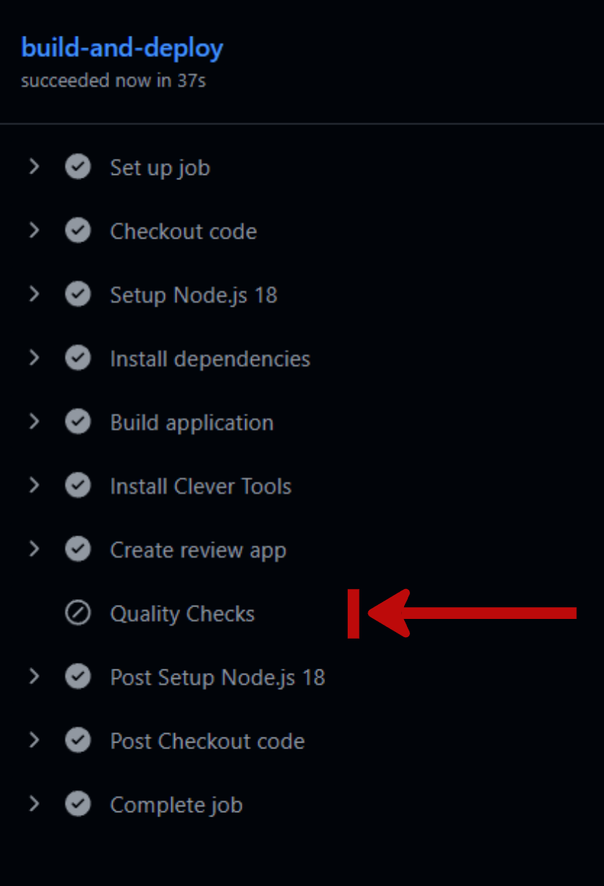

> CheckPoint : pourquoi cette étape a été by-passée ? 

### 4. Créer une PR  pour modifier le Header de l'application 

Nous allons modifier le code source pour saisir nos informations dans le Header de l'application afin de bien valider que c'est notre code qui est déployé sur notre application Clever Cloud. 

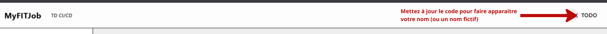

1. Créer une branche local pour effectuer votre fix: `git checkout -b fix/avatar`

2. Dans le code source de votre repo cloné, sur cette nouvelle branche, dans le répertoire du projet Front `./src/MyFITJob.Frontend`, lancer le serveur de développement: `npm run dev` 

2. Mettre à jour le fichier `/src/MyFITJob.Frontend/src/components/Header.tsx`, en remplaçant le "TODO" par votre nom (ou un nom fictif, c'est juste pour valider l'hypothèse de déploiement)

*exemple:* 

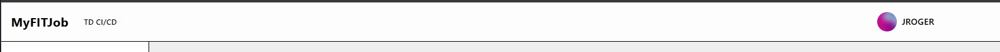

3. Commit votre changement : 
`git add .` 
`git commit -m "Fix(Header): fix du nom dans le header"`
`git push --set-upstream origin fix/avatar`

4. Se connecter sur votre repository GitHub
> Vous devriez voir un bandeau vous annonçant que Github a détecter une novuelle branche : 

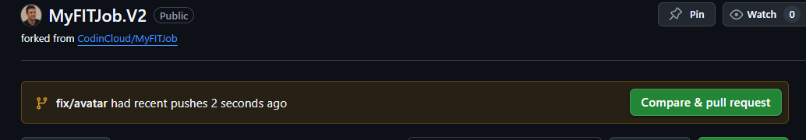

5. Cliquer sur "Compare & Pull Request" dans ce bandeau, et compléter la description. Par exemple: 

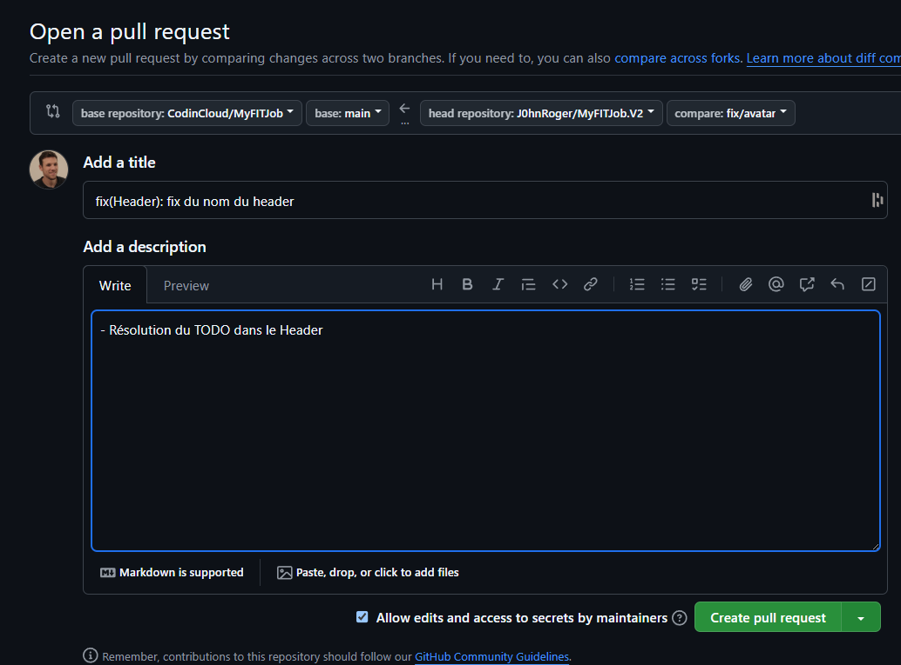

**🔥Vous êtes sur le point de créer votre première PR sur un repository**

> Une Pull Request est une proposition de fusion (“merge”) d’une branche de travail vers la branche de référence (souvent main/master) dans un dépôt Git ; elle sert de point central pour la revue de code, la discussion et le déclenchement automatique de la CI/CD.

3. Cliquer sur "Create Pull Request" pour valider votre demande de fusion


4. Un check vous indiquant qu'aucun conflit n'est présent, et surtout : l'intégration continue se lance automatiquement ! 

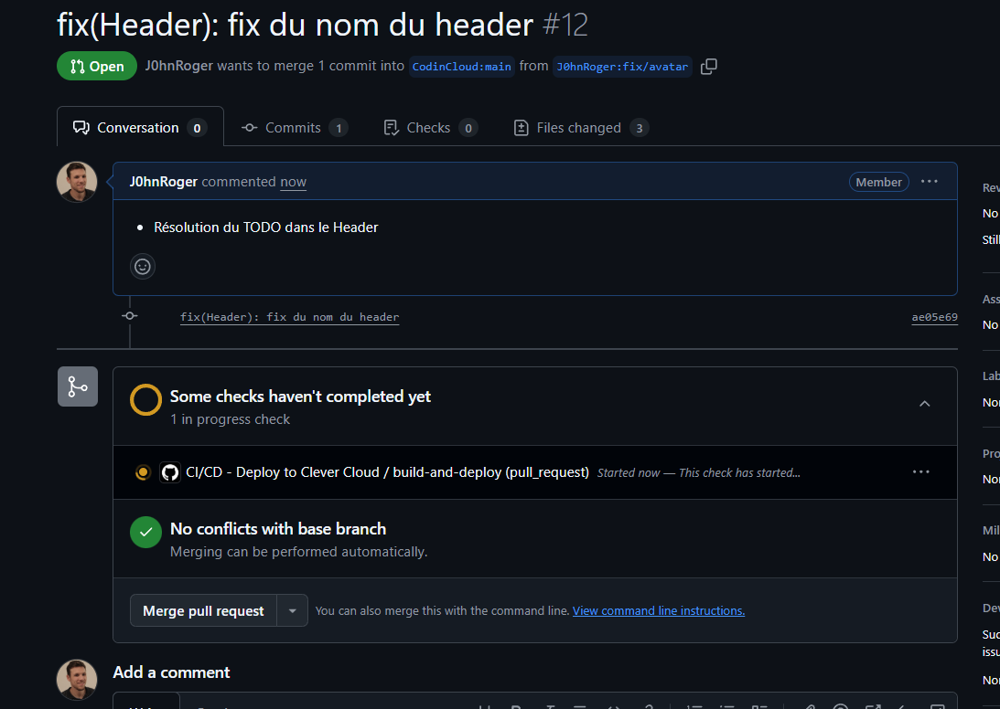

5. Si tout s'est bien passé, vous devriez avoir un résultat positif, et dans les logs de la CI/CD, de solides tests de qualité/lint et tests unitaires effectués avec succès 
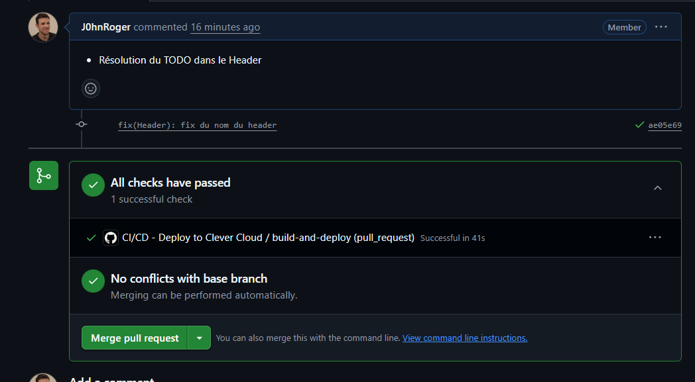

6. Maintenant que la phase d'intégration continue est positive(CI), il ne reste plus qu'à lancer la phase de Continuous Déploiement (CD) : cliquer sur "Merge pull request", puis sur "Confirm Merge" : 
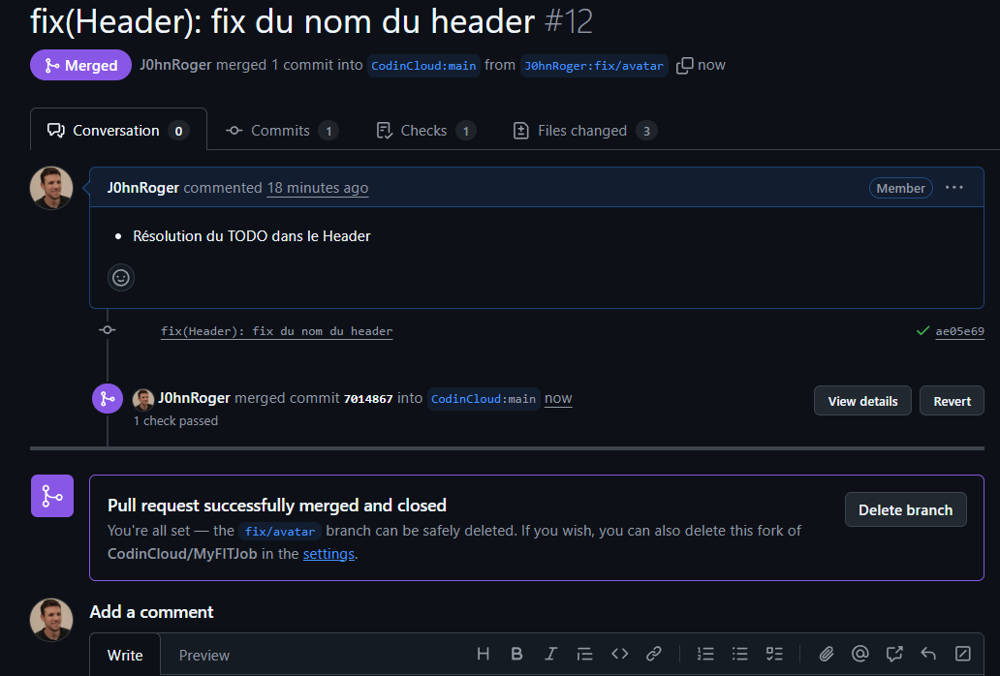

7. Se rendre sur l'onglet "Actions" : le workflow de publication est normalement en train de s'executer. 

**Checkpoint:** 
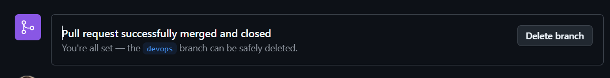

6. Se rendre dans l'onglet `Action` - vous devez voir le workflow `Github Action` tourner :
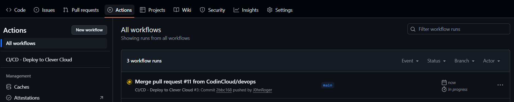

## 5. Vérification finale

1. **Accéder à l'application sur Clever Cloud**
   - Vous devriez voir votre déploiement dans l'onglet "Activity"
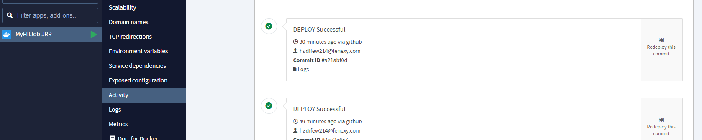

   - Vérifiez que l'application s'affiche correctement : le même lien qu'en début de TP, dans le Header : 
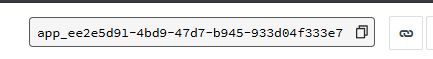

   - Vérifiez que votre nom apparaît dans le header


## ✅ Critères de réussite

- [ ] Le pipeline GitHub Actions passe (build vert)
- [ ] L'application est accessible via l'URL Clever Cloud
- [ ] Votre nom apparaît dans le header

## 🔧 Dépannage

### Problème : Build échoue
- Vérifiez que tous les secrets sont configurés
- Vérifiez la syntaxe du code TypeScript

### Problème : Déploiement échoue
- Vérifiez les tokens Clever Cloud
- Vérifiez l'ID de l'application

### Problème : Application ne s'affiche pas
- Vérifiez les logs dans la console Clever Cloud
- Vérifiez que le fichier `.clever.json` est présent

## 📚 Ressources

- [Documentation Clever Cloud](https://www.clever-cloud.com/developers/doc/quickstart/)
- [GitHub Actions Documentation](https://docs.github.com/en/actions)
- [MSW Documentation](https://mswjs.io/)

## 🎉 Félicitations !

Vous avez réussi à mettre en place un pipeline CI/CD complet avec :
- Build automatique avec GitHub Actions
- Déploiement automatique sur Clever Cloud
- Tests et validation automatiques
- Personnalisation de l'application 